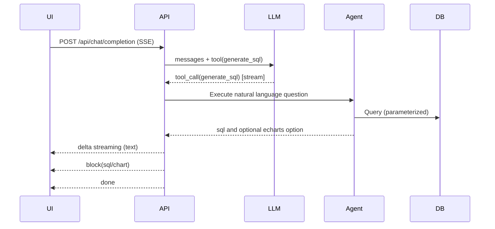

# SQLBox

AI powered SQL agent with vector-indexed schema retrieval

[简体中文](README.zh-CN.md)

[](LICENSE) [](https://dotnet.microsoft.com/) [](https://react.dev/) [](https://vite.dev/) [](https://www.typescriptlang.org/) [](https://platform.openai.com/)

- Production-ready SQL agent that turns natural language into safe, parameterized SQL
- Vector-indexed schema retrieval to ground SQL generation with database context
- SSE streaming responses with delta text and typed content blocks
- First-class ECharts option generation with data placeholders injection
- Works with SQLite, PostgreSQL, MySQL, SQL Server

Repository structure (key files)

- [Program.cs](src/SQLAgent.Hosting/Program.cs)
- [EndpointRouteBuilderExtensions.cs](src/SQLAgent.Hosting/Extensions/EndpointRouteBuilderExtensions.cs)
- [ChatService.cs](src/SQLAgent.Hosting/Services/ChatService.cs)
- [SSEMessage.cs](src/SQLAgent.Hosting/Dto/SSEMessage.cs)
- [SQLAgentClient.cs](src/SQLAgent/Facade/SQLAgentClient.cs)
- [SQLAgentBuilder.cs](src/SQLAgent/Facade/SQLAgentBuilder.cs)
- [SQLAgentOptions.cs](src/SQLAgent/Facade/SQLAgentOptions.cs)
- [web/vite.config.ts](web/vite.config.ts)

Key entry points

- [EndpointRouteBuilderExtensions.MapAllApis()](src/SQLAgent.Hosting/Extensions/EndpointRouteBuilderExtensions.cs:193)
- [ChatService.CompletionAsync()](src/SQLAgent.Hosting/Services/ChatService.cs:39)

## Architecture

The system consists of a .NET 8 minimal API backend and a React + Vite frontend. The backend exposes REST endpoints for connections, providers, settings and vector indexing, plus an SSE chat endpoint. The SQL generation pipeline uses OpenAI function calling to invoke a generate_sql tool; the agent produces parameterized SQL and can generate ECharts options with data placeholders that are later injected with real data.

```mermaid
flowchart LR
  UI[Web UI (React)] -->|SSE /api/chat/completion| API[.NET Hosting API]
  API -->|function calling| LLM[LLM Client]
  LLM -->|tool generate_sql| Agent[SQLAgentClient]
  Agent -->|search tables/schema| DB[Target Database]
  Agent -->|embed & retrieve| Vec[SQLite Vec Store]
  API -->|delta / block / done / error| UI
```

Backend building blocks

- Minimal host and wiring in [Program.cs](src/SQLAgent.Hosting/Program.cs)
- Endpoint mapping in [EndpointRouteBuilderExtensions.cs](src/SQLAgent.Hosting/Extensions/EndpointRouteBuilderExtensions.cs)
- SSE contract/types in [SSEMessage.cs](src/SQLAgent.Hosting/Dto/SSEMessage.cs)
- SQL agent facade in [SQLAgentClient.cs](src/SQLAgent/Facade/SQLAgentClient.cs)
- Vector store (SQLite-vec) and embedder wiring in Infrastructure

### SSE data flow



SSE message types (see [SSEMessage.cs](src/SQLAgent.Hosting/Dto/SSEMessage.cs))

- delta: incremental text chunks
- block: typed content block (sql, data, chart, error)
- done: completion with elapsedMs
- error: error details

Example delta

```json
{ "type": "delta", "delta": "Generating SQL..." }
```

Example SQL block

```json
{ "type": "block", "block": { "type": "sql", "sql": "SELECT ...", "tables": ["orders"], "dialect": "sqlite" } }
```

Example Chart block (ECharts option JSON string)

```json
{ "type": "block", "block": { "type": "chart", "chartType": "echarts", "echartsOption": "{ ... }" } }
```

Note: Current server streams SQL and optional ECharts option. Data blocks can be added later if needed.

## Quickstart

Prerequisites

- .NET 8 SDK
- Node.js 20+
- PNPM

Backend

- Default port is 18080 as configured in [launchSettings.json](src/SQLAgent.Hosting/Properties/launchSettings.json)
- Run the hosting project:

```bash
dotnet run --project src/SQLAgent.Hosting/SQLAgent.Hosting.csproj
```

Frontend

- Dev server defaults to 5173
- The dev proxy for API is defined in [web/vite.config.ts](web/vite.config.ts). If you change backend port, update the proxy target or set VITE_API_BASE_URL.
- Install and run:

```bash
cd web
pnpm install
pnpm dev
```

Open http://localhost:5173 and configure Providers and Connections first.

## Configuration

System settings

- The backend exposes GET/PUT /api/settings (merged with an optional settings.json at content root). Mapping is in [EndpointRouteBuilderExtensions.MapSettingsApis()](src/SQLAgent.Hosting/Extensions/EndpointRouteBuilderExtensions.cs:106)
- Recommended settings.json:

```json
{
  "EmbeddingProviderId": "openai",
  "EmbeddingModel": "text-embedding-3-small",
  "VectorDbPath": "Data Source=vectors.db",
  "VectorCollection": "table_vectors",
  "AutoCreateCollection": true,
  "VectorCacheExpireMinutes": 60,
  "DefaultChatProviderId": "openai",
  "DefaultChatModel": "gpt-4o-mini"
}
```

AI providers

- POST /api/providers with your OpenAI (or compatible) key. Input schema expects availableModels as an array.

```json
{
  "name": "OpenAI",
  "type": "OpenAI",
  "endpoint": "",
  "apiKey": "sk-...your key...",
  "availableModels": ["gpt-4o-mini", "text-embedding-3-small"],
  "defaultModel": "gpt-4o-mini",
  "isEnabled": true,
  "extraConfig": {}
}
```

- List models for a provider: GET /api/providers/{id}/models

Database connections

- POST /api/connections to register a database

```json
{
  "name": "local-sqlite",
  "databaseType": "sqlite",
  "connectionString": "Data Source=app.db",
  "description": "local dev"
}
```

- Test a connection: POST /api/connections/{id}/test

Vector index

- Initialize or update the vector index for a connection (SQLite vec store)

```bash
curl -X POST http://localhost:18080/api/connections/{id}/index/init
curl -X POST http://localhost:18080/api/connections/{id}/index/update
```

## Chat completion (SSE)

- Frontend SSE client is implemented in [sse.ts](web/src/services/sse.ts)
- Endpoint: POST /api/chat/completion
- Minimal request (matches [CompletionInput](src/SQLAgent.Hosting/Dto/CompletionInput.cs)):

```json
{
  "connectionId": "conn-id",
  "messages": [{ "role": "user", "content": "top 10 products by sales" }],
  "execute": true,
  "suggestChart": true,
  "providerId": "openai",
  "model": "gpt-4o-mini"
}
```

- The server streams:
  - delta messages with reasoning or status text
  - SQL blocks for generated statements (parameterized)
  - optional chart blocks with ECharts option JSON
  - done message with elapsedMs

## Security and quality

- Parameterized SQL only. The agent produces SQL with parameters and never inlines user input.
- Read vs write control. You can configure write permission via agent options. See [SQLAgentOptions](src/SQLAgent/Facade/SQLAgentOptions.cs).
- Server-side validation planned to report SQL risks.

## Supported databases and models

- Databases: SQLite, PostgreSQL, MySQL, SQL Server
- Models: OpenAI chat gpt-4o-mini; embeddings text-embedding-3-small (via configurable provider)

## Troubleshooting

- SSE stops abruptly: Check reverse proxy buffering and ensure header X-Accel-Buffering is respected
- Empty vector search or options generation missing: initialize index and verify EmbeddingProviderId/EmbeddingModel
- API reference: In Development, OpenAPI/Scalar is available at /scalar (see [Program.cs](src/SQLAgent.Hosting/Program.cs))

## Roadmap

- Additional vector backends
- Richer schema statistics and join graph
- Pluggable validators and auto-repair strategies
- Data blocks streaming for query results

## Contributing

- Issues and PRs are welcome. Please add tests where applicable and follow existing coding style.

## License

MIT