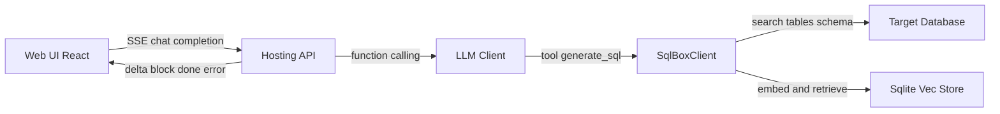
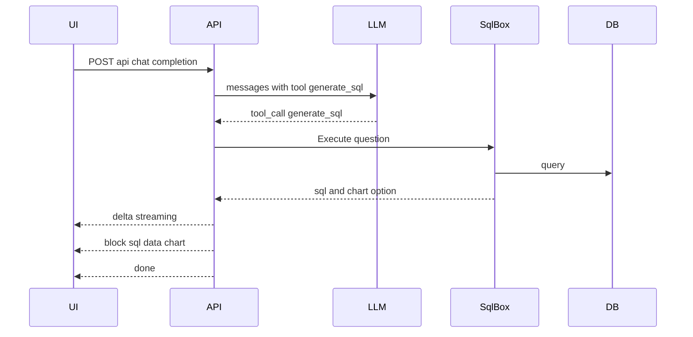

# SQLBox

AI powered SQL agent with vector indexed schema retrieval

[](LICENSE) [](https://dotnet.microsoft.com/) [](https://react.dev/) [](https://vite.dev/) [](https://www.typescriptlang.org/) [](https://platform.openai.com/)

- Production-ready SQL agent that turns natural language into safe, parameterized SQL
- Vector indexed schema retrieval for relevance aware query generation
- Streaming SSE responses with delta and content blocks
- First class ECharts option generation with data injection placeholders
- Works with Sqlite, PostgreSQL, MySQL, SQL Server

Repo structure at a glance

- [Program.cs](src/SQLAgent.Hosting/Program.cs)
- [EndpointRouteBuilderExtensions.cs](src/SQLAgent.Hosting/Extensions/EndpointRouteBuilderExtensions.cs)
- [ChatService.cs](src/SQLAgent.Hosting/Services/ChatService.cs)
- [SqlBoxClient.cs](src/SQLAgent/Facade/SqlBoxClient.cs)
- [EmbeddingSchemaIndexer.cs](src/SQLAgent/Infrastructure/Defaults/EmbeddingSchemaIndexer.cs)
- [VectorSchemaRetriever.cs](src/SQLAgent/Infrastructure/Defaults/VectorSchemaRetriever.cs)
- [web/vite.config.ts](web/vite.config.ts)

Key entry points

- [EndpointRouteBuilderExtensions.MapAllApis()](src/SQLAgent.Hosting/Extensions/EndpointRouteBuilderExtensions.cs:194)
- [ChatService.CompletionAsync()](src/SQLAgent.Hosting/Services/ChatService.cs:39)

## Architecture

The system consists of a .NET 8 minimal API backend and a React + Vite frontend. The backend exposes REST endpoints for connections, providers, settings and vector indexing, plus an SSE chat endpoint. The SQL generation pipeline uses OpenAI function calling to invoke SqlBox tools which search schema, fetch table metadata, produce parameterized SQL and optionally generate ECharts options.



Backend building blocks

- Hosting and wiring in [Program.cs](src/SQLAgent.Hosting/Program.cs)
- Endpoint mapping in [EndpointRouteBuilderExtensions.cs](src/SQLAgent.Hosting/Extensions/EndpointRouteBuilderExtensions.cs)
- SSE types in [SSEMessage.cs](src/SQLAgent.Hosting/Dto/SSEMessage.cs)
- SQL agent facade in [SqlBoxClient.cs](src/SQLAgent/Facade/SqlBoxClient.cs)
- Vector indexing and retrieval in [EmbeddingSchemaIndexer.cs](src/SQLAgent/Infrastructure/Defaults/EmbeddingSchemaIndexer.cs) and [VectorSchemaRetriever.cs](src/SQLAgent/Infrastructure/Defaults/VectorSchemaRetriever.cs)

### SSE data flow



SSE message types

- delta: incremental text chunks
- block: content blocks sql data chart
- done: completion with elapsedMs
- error: error details

Example delta

```json
{ "type": "delta", "delta": "Generating SQL..." }
```

Example SQL block

```json
{ "type": "block", "block": { "type": "sql", "sql": "SELECT ...", "tables": ["orders"], "dialect": "sqlite" } }
```

## Quickstart

Prerequisites

- .NET 8 SDK
- Node.js 20+
- PNPM

Backend

- Configure ports. Default project uses 18080 via [launchSettings.json](src/SQLAgent.Hosting/Properties/launchSettings.json). If you prefer 5218, change applicationUrl and Urls and update the frontend proxy accordingly.
- Run

```bash
dotnet run --project src/SQLAgent.Hosting/SQLAgent.Hosting.csproj
```

Frontend

- Ensure the dev proxy in [web/vite.config.ts](web/vite.config.ts) points to backend url
- Optionally set VITE_API_BASE_URL to override default /api
- Install and run

```bash
cd web
pnpm install
pnpm dev
```

Visit http://localhost:5173 and open Providers and Connections to configure.

## Configuration

System settings

- The backend reads and persists settings at runtime via [MapSettingsApis()](src/SQLAgent.Hosting/Extensions/EndpointRouteBuilderExtensions.cs:106)
- Recommended values

```json
{
  "EmbeddingProviderId": "openai",
  "EmbeddingModel": "text-embedding-3-small",
  "VectorDbPath": "Data Source=vectors.db",
  "VectorCollection": "table_vectors",
  "DistanceMetric": "Cosine",
  "AutoCreateCollection": true
}
```

AI providers

- POST /api/providers with an OpenAI key. Example payload

```json
{
  "name": "OpenAI",
  "type": "OpenAI",
  "endpoint": "",
  "apiKey": "sk-...your key...",
  "availableModels": "gpt-4o-mini,text-embedding-3-small",
  "defaultModel": "gpt-4o-mini",
  "isEnabled": true
}
```

Database connections

- POST /api/connections to register a database

```json
{
  "name": "local-sqlite",
  "databaseType": "sqlite",
  "connectionString": "Data Source=app.db",
  "description": "local dev"
}
```

Vector index

- Initialize or update per connection

```bash
curl -X POST http://localhost:18080/api/connections/{id}/index/init
curl -X POST http://localhost:18080/api/connections/{id}/index/update
```

Chat completion

- The frontend uses SSE, see [web/src/services/sse.ts](web/src/services/sse.ts)
- Minimal request

```json
{
  "connectionId": "conn-id",
  "messages": [{ "role": "user", "content": "top 10 products by sales" }],
  "execute": true,
  "maxRows": 100,
  "suggestChart": true,
  "providerId": "openai",
  "model": "gpt-4o-mini"
}
```

## Security and quality

- Parameterized SQL only. The agent produces SQL with parameters and never inlines user input.
- Read vs write control. You can enforce read only with validation and options in [SqlBoxOptions](src/SQLAgent/Facade/SqlBoxOptions.cs).
- SQL validation reports warnings and errors server side.

## Supported databases and models

- Databases: Sqlite, PostgreSQL, MySQL, SQL Server
- Models: OpenAI chat gpt-4o-mini, embedding text-embedding-3-small

## Troubleshooting

- If SSE stops abruptly, check reverse proxy buffering and ensure header X-Accel-Buffering is respected
- If vector search returns empty, run index init and verify EmbeddingProviderId and EmbeddingModel
- Use /scalar in dev to inspect OpenAPI when enabled in development

## Roadmap

- Additional vector backends
- Advanced schema statistics and join graph
- Pluggable validators and repair strategies

## License

MIT

---

# SQLBox 中文版

以向量索引驱动的 AI SQL 代理

- 自然语言生成安全的参数化 SQL
- 向量化表与列描述进行相关性检索
- SSE 流式返回 delta 与内容块 sql 数据 图表
- 支持自动生成 ECharts 配置并注入数据占位符
- 兼容 Sqlite PostgreSQL MySQL SQL Server

关键入口

- [Program.cs](src/SQLAgent.Hosting/Program.cs)
- [EndpointRouteBuilderExtensions.MapAllApis()](src/SQLAgent.Hosting/Extensions/EndpointRouteBuilderExtensions.cs:194)
- [ChatService.CompletionAsync()](src/SQLAgent.Hosting/Services/ChatService.cs:39)

## 架构总览


## 快速开始

- 安装 .NET 8 SDK 和 Node 20+ 与 PNPM
- 后端默认端口 18080 如需 5218 可修改 [launchSettings.json](src/SQLAgent.Hosting/Properties/launchSettings.json) 并同步前端代理 [web/vite.config.ts](web/vite.config.ts)
- 启动后端

```bash
dotnet run --project src/SQLAgent.Hosting/SQLAgent.Hosting.csproj
```

- 启动前端

```bash
cd web
pnpm install
pnpm dev
```

浏览器访问 http://localhost:5173 完成 提供商 与 连接 配置

## 配置指南

- 系统设置通过 [MapSettingsApis()](src/SQLAgent.Hosting/Extensions/EndpointRouteBuilderExtensions.cs:106) 暴露 GET PUT
- 推荐 EmbeddingModel 使用 text-embedding-3-small 并设置 EmbeddingProviderId 为 openai
- 提供商 POST /api/providers 示例见上文英文部分
- 连接 POST /api/connections 支持 sqlite postgres mysql sqlserver

向量索引

- 初始化与增量更新接口

```bash
curl -X POST http://localhost:18080/api/connections/{id}/index/init
curl -X POST http://localhost:18080/api/connections/{id}/index/update
```

对话与 SSE

- 前端 SSE 实现在 [web/src/services/sse.ts](web/src/services/sse.ts)
- 消息类型 delta block done error

## 安全与质量

- 始终使用参数化查询 防止注入
- 可按需限制写操作 参见 [SqlBoxOptions](src/SQLAgent/Facade/SqlBoxOptions.cs)
- 服务端校验会对风险 SQL 给出警告或错误

## 支持矩阵

- 数据库 Sqlite PostgreSQL MySQL SQL Server
- 模型 OpenAI gpt-4o-mini 与 text-embedding-3-small

## 许可

MIT