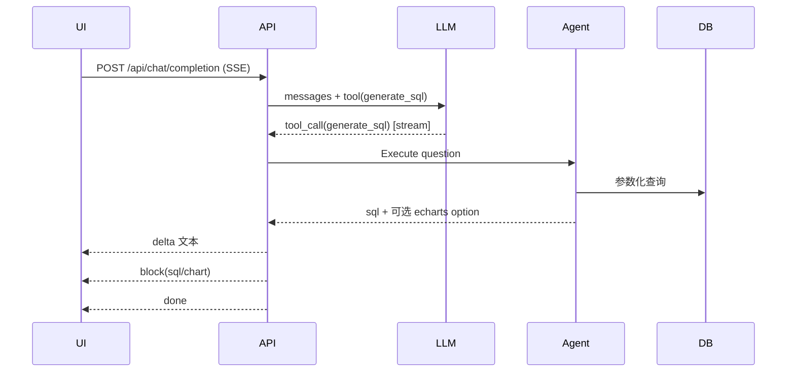

# SQLBox

以向量索引驱动的 AI SQL 代理

[English README](README.md)

[](LICENSE) [](https://dotnet.microsoft.com/) [](https://react.dev/) [](https://vite.dev/) [](https://www.typescriptlang.org/) [](https://platform.openai.com/)

- 自然语言生成安全的参数化 SQL
- 表与列向量索引，基于相似度检索构建上下文
- SSE 流式输出 delta 与内容块（SQL/数据/图表）
- 自动生成 ECharts 配置并支持数据占位符注入
- 兼容 SQLite / PostgreSQL / MySQL / SQL Server

仓库结构（关键文件）

- [Program.cs](src/SQLAgent.Hosting/Program.cs)
- [EndpointRouteBuilderExtensions.cs](src/SQLAgent.Hosting/Extensions/EndpointRouteBuilderExtensions.cs)
- [SSEMessage.cs](src/SQLAgent.Hosting/Dto/SSEMessage.cs)
- [ChatService.cs](src/SQLAgent.Hosting/Services/ChatService.cs)
- [SQLAgentClient.cs](src/SQLAgent/Facade/SQLAgentClient.cs)
- [SQLAgentBuilder.cs](src/SQLAgent/Facade/SQLAgentBuilder.cs)
- [SQLAgentOptions.cs](src/SQLAgent/Facade/SQLAgentOptions.cs)
- [web/vite.config.ts](web/vite.config.ts)

关键入口

- [EndpointRouteBuilderExtensions.MapAllApis()](src/SQLAgent.Hosting/Extensions/EndpointRouteBuilderExtensions.cs:192)
- [ChatService.CompletionAsync()](src/SQLAgent.Hosting/Services/ChatService.cs:39)

## 架构总览

系统由 .NET 8 Minimal API 后端与 React + Vite 前端组成。后端提供连接、提供商、设置、向量索引等 REST API 以及一个 SSE 聊天端点。SQL 生成通过 OpenAI Function Calling 调用 generate_sql 工具实现，产出参数化 SQL，并可返回带有数据占位符的 ECharts 配置。

```mermaid
flowchart LR
  UI[Web UI (React)] -->|SSE /api/chat/completion| API[.NET Hosting API]
  API -->|function calling| LLM[LLM Client]
  LLM -->|tool generate_sql| Agent[SQLAgentClient]
  Agent -->|search tables/schema| DB[Target Database]
  Agent -->|embed & retrieve| Vec[SQLite Vec Store]
  API -->|delta / block / done / error| UI
```

后端构件

- 入口与装配见 [Program.cs](src/SQLAgent.Hosting/Program.cs)
- 路由映射见 [EndpointRouteBuilderExtensions.cs](src/SQLAgent.Hosting/Extensions/EndpointRouteBuilderExtensions.cs)
- SSE 协议与类型见 [SSEMessage.cs](src/SQLAgent.Hosting/Dto/SSEMessage.cs)
- SQL 代理外观 [SQLAgentClient.cs](src/SQLAgent/Facade/SQLAgentClient.cs)
- 向量存储与嵌入器接入在 Infrastructure 模块中

### SSE 数据流



SSE 消息类型（见 [SSEMessage.cs](src/SQLAgent.Hosting/Dto/SSEMessage.cs)）

- delta：增量文本
- block：内容块（sql / data / chart / error）
- done：完成，包含 elapsedMs
- error：错误详情

示例 delta

```json
{ "type": "delta", "delta": "Generating SQL..." }
```

示例 SQL block

```json
{ "type": "block", "block": { "type": "sql", "sql": "SELECT ...", "tables": ["orders"], "dialect": "sqlite" } }
```

示例图表 block（ECharts option JSON 字符串）

```json
{ "type": "block", "block": { "type": "chart", "chartType": "echarts", "echartsOption": "{ ... }" } }
```

## 快速开始

先决条件

- .NET 8 SDK
- Node.js 20+
- PNPM

后端

- 默认端口 18080（见 [launchSettings.json](src/SQLAgent.Hosting/Properties/launchSettings.json)）
- 运行：

```bash
dotnet run --project src/SQLAgent.Hosting/SQLAgent.Hosting.csproj
```

前端

- 开发端口默认 5173
- API 代理在 [web/vite.config.ts](web/vite.config.ts)，如修改后端端口，请同步更新或设置 VITE_API_BASE_URL
- 安装并启动：

```bash
cd web
pnpm install
pnpm dev
```

打开 http://localhost:5173，先在「提供商」与「连接」页面完成配置

## 配置

系统设置

- 后端通过 [EndpointRouteBuilderExtensions.MapSettingsApis()](src/SQLAgent.Hosting/Extensions/EndpointRouteBuilderExtensions.cs:106) 暴露 GET/PUT /api/settings；如存在 content root 下的 settings.json，会在读取时合并
- 推荐 settings.json：

```json
{
  "EmbeddingProviderId": "openai",
  "EmbeddingModel": "text-embedding-3-small",
  "VectorDbPath": "Data Source=vectors.db",
  "VectorCollection": "table_vectors",
  "AutoCreateCollection": true,
  "VectorCacheExpireMinutes": 60,
  "DefaultChatProviderId": "openai",
  "DefaultChatModel": "gpt-4o-mini"
}
```

AI 提供商

- POST /api/providers 创建或更新你的 OpenAI（或兼容）配置，availableModels 使用数组

```json
{
  "name": "OpenAI",
  "type": "OpenAI",
  "endpoint": "",
  "apiKey": "sk-...your key...",
  "availableModels": ["gpt-4o-mini", "text-embedding-3-small"],
  "defaultModel": "gpt-4o-mini",
  "isEnabled": true,
  "extraConfig": {}
}
```

- 获取可用模型：GET /api/providers/{id}/models

数据库连接

- POST /api/connections 注册数据库

```json
{
  "name": "local-sqlite",
  "databaseType": "sqlite",
  "connectionString": "Data Source=app.db",
  "description": "local dev"
}
```

- 测试连接：POST /api/connections/{id}/test

向量索引

- 为连接初始化或更新（SQLite vec 存储）：

```bash
curl -X POST http://localhost:18080/api/connections/{id}/index/init
curl -X POST http://localhost:18080/api/connections/{id}/index/update
```

## 对话与 SSE

- 前端 SSE 客户端见 [web/src/services/sse.ts](web/src/services/sse.ts)
- 端点：POST /api/chat/completion（由 [ChatService.CompletionAsync()](src/SQLAgent.Hosting/Services/ChatService.cs:39) 实现）
- 最小请求（与 [CompletionInput](src/SQLAgent.Hosting/Dto/CompletionInput.cs) 对齐）：

```json
{
  "connectionId": "conn-id",
  "messages": [{ "role": "user", "content": "销量 Top 10 产品" }],
  "execute": true,
  "suggestChart": true,
  "providerId": "openai",
  "model": "gpt-4o-mini"
}
```

- 服务器将按序流式返回：
  - delta：解释/状态文本
  - block(sql)：生成的参数化 SQL
  - block(chart)：可选 ECharts 配置（JSON 字符串）
  - done：完成并附带 elapsedMs

## 安全与质量

- 始终参数化查询，禁止内联用户输入
- 可按需限制写操作，见 [SQLAgentOptions](src/SQLAgent/Facade/SQLAgentOptions.cs)
- 服务器端 SQL 风险校验与报告（规划中，可扩展）

## 支持矩阵

- 数据库：SQLite / PostgreSQL / MySQL / SQL Server
- 模型：OpenAI gpt-4o-mini（对话）、text-embedding-3-small（嵌入）

## 故障排查

- SSE 断流：检查反向代理缓冲并确保遵循 X-Accel-Buffering 头
- 向量检索/图表为空：先执行索引初始化并检查 EmbeddingProviderId / EmbeddingModel
- 开发文档：Development 环境下可访问 /scalar（见 [Program.cs](src/SQLAgent.Hosting/Program.cs)）

## 路线图

- 更多向量后端
- 更丰富的 schema 统计与关系图
- 可插拔的校验与自动修复策略
- 数据块（data）流式返回

## 贡献

欢迎提交 Issue 与 PR。请尽量附带测试并遵循现有代码风格。

## 许可

MIT