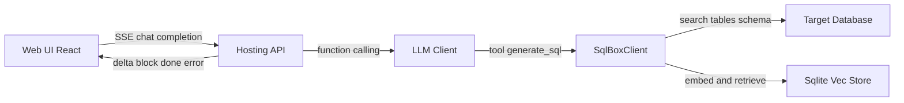
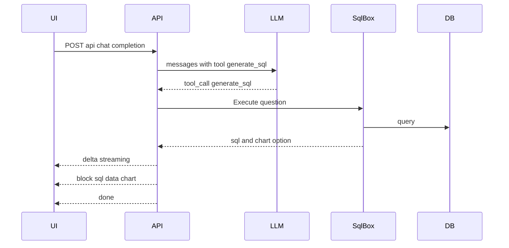

# SQLBox

以向量索引驱动的 AI SQL 代理

[English README](README.md)

[](LICENSE) [](https://dotnet.microsoft.com/) [](https://react.dev/) [](https://vite.dev/) [](https://www.typescriptlang.org/) [](https://platform.openai.com/)

- 自然语言生成安全的参数化 SQL
- 表与列向量索引，基于相似度检索构建上下文
- SSE 流式输出 delta 与内容块（SQL/数据/图表）
- 自动生成 ECharts 配置并支持数据占位符注入
- 兼容 Sqlite / PostgreSQL / MySQL / SQL Server

关键入口

- [Program.cs](src/SQLAgent.Hosting/Program.cs)
- [EndpointRouteBuilderExtensions.cs](src/SQLAgent.Hosting/Extensions/EndpointRouteBuilderExtensions.cs)
- [ChatService.cs](src/SQLAgent.Hosting/Services/ChatService.cs)
- [SqlBoxClient.cs](src/SQLAgent/Facade/SqlBoxClient.cs)

## 架构总览



### SSE 数据流



## 快速开始

先决条件

- .NET 8 SDK
- Node.js 20+
- PNPM

后端（默认端口 18080，可按需改为 5218）

```bash
dotnet run --project src/SQLAgent.Hosting/SQLAgent.Hosting.csproj
```

前端（开发端口 5173）

- 如切换后端端口，请同步修改 [web/vite.config.ts](web/vite.config.ts) 代理目标，或设置环境变量 VITE_API_BASE_URL

```bash
cd web
pnpm install
pnpm dev
```

打开 http://localhost:5173 按引导完成「提供商」与「连接」配置

## 配置

系统设置（settings.json 通过 API 暴露，开发模式下后端启动时可自动合并）

推荐值

```json
{
  "EmbeddingProviderId": "openai",
  "EmbeddingModel": "text-embedding-3-small",
  "VectorDbPath": "Data Source=vectors.db",
  "VectorCollection": "table_vectors",
  "DistanceMetric": "Cosine",
  "AutoCreateCollection": true
}
```

AI 提供商

```json
{
  "name": "OpenAI",
  "type": "OpenAI",
  "endpoint": "",
  "apiKey": "sk-...your key...",
  "availableModels": "gpt-4o-mini,text-embedding-3-small",
  "defaultModel": "gpt-4o-mini",
  "isEnabled": true
}
```

数据库连接

```json
{
  "name": "local-sqlite",
  "databaseType": "sqlite",
  "connectionString": "Data Source=app.db",
  "description": "local dev"
}
```

向量索引

```bash
curl -X POST http://localhost:18080/api/connections/{id}/index/init
curl -X POST http://localhost:18080/api/connections/{id}/index/update
```

对话与 SSE

- 前端 SSE 实现在 [web/src/services/sse.ts](web/src/services/sse.ts)
- 消息类型 delta / block / done / error
- 请求示例

```json
{
  "connectionId": "conn-id",
  "messages": [{ "role": "user", "content": "销量 Top 10 产品" }],
  "execute": true,
  "maxRows": 100,
  "suggestChart": true,
  "providerId": "openai",
  "model": "gpt-4o-mini"
}
```

## 安全与质量

- 始终参数化查询，禁止内联用户输入
- 可按需限制写操作，参见 [SqlBoxOptions](src/SQLAgent/Facade/SqlBoxOptions.cs)
- 服务端校验器会给出风险警告与错误

## 支持矩阵

- 数据库：Sqlite / PostgreSQL / MySQL / SQL Server
- 模型：OpenAI gpt-4o-mini（对话）、text-embedding-3-small（嵌入）

## 故障排查

- SSE 断流：检查反向代理缓冲与 X-Accel-Buffering
- 向量检索为空：先执行索引初始化，检查 EmbeddingProviderId/EmbeddingModel
- 开发文档：在 Development 环境启用后可访问 /scalar

## 路线图

- 更多向量后端
- 更丰富的 schema 统计与关系图
- 可插拔的校验与自动修复策略

## 许可

MIT